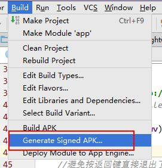

# 使用webview制作手册

有时候我们想：
1、把自己的网站或者h5应用包装成一个APP，虽然实际情况并不需要；
2、把离线的html手册包装成一个APP，方便随时随地的浏览。

本节主要是实现该想法。这里以《PHP之道》这本在线的书为例。

## 准备工作

1、需要打包的链接或者离线html；
2、icon，App图标。

## 开始

AndroidManifest.xml文件需要给网络访问权限：
``` xml
<uses-permission android:name="android.permission.INTERNET"></uses-permission>
```

完整的xml:
``` xml
<?xml version="1.0" encoding="utf-8"?>
<manifest xmlns:android="http://schemas.android.com/apk/res/android"
    package="com.a52fhy.phptherightway">

    <uses-permission android:name="android.permission.INTERNET"></uses-permission>

    <application
        android:allowBackup="true"
        android:icon="@mipmap/ic_launcher"
        android:label="@string/app_name"
        android:supportsRtl="true"
        android:theme="@style/AppTheme">
        <activity
            android:name="com.a52fhy.phptherightway.MainActivity"
            android:theme="@style/Theme.AppCompat.Light.NoActionBar"
            >
            <intent-filter>
                <action android:name="android.intent.action.MAIN" />

                <category android:name="android.intent.category.LAUNCHER" />
            </intent-filter>
        </activity>
    </application>

</manifest>
```

其中`activity`里`android:theme`里指明了`NoActionBar`，表示要全屏风格。

string.xml里需要定义：
``` xml
<resources>
    <string name="app_name">PHP之道</string>
</resources>
```

## 编写Activity

核心的内容便是Activity的编写。这里Activity类名是MainActivity。

这里直接上代码，原因是我在代码注释里写的很清楚了。
``` java
package com.a52fhy.phptherightway;

import android.support.v7.app.AppCompatActivity;
import android.os.Bundle;
import android.view.KeyEvent;
import android.view.WindowManager;
import android.webkit.WebView;
import android.view.Window;
import android.webkit.WebViewClient;

public class MainActivity extends AppCompatActivity {

    private WebView wv;

    @Override
    protected void onCreate(Bundle savedInstanceState) {
        super.onCreate(savedInstanceState);
//        setContentView(R.layout.activity_main);

        //隐藏标题和最上面的电池电量及信号栏（全屏），可选
        requestWindowFeature(Window.FEATURE_NO_TITLE);//隐藏标题
        getWindow().setFlags(WindowManager.LayoutParams.FLAG_FULLSCREEN, WindowManager.LayoutParams.FLAG_FULLSCREEN);

        //获取webview实例
        wv = new WebView(this);
        wv.getSettings().setJavaScriptEnabled(true);//支持JavaScript功能，建议开启

        //设置子链接使用webview打开。如果不设置，会调用系统其它浏览器打开
        wv.setWebViewClient(new WebViewClient(){
            @Override
            public boolean shouldOverrideUrlLoading(WebView view, String url) {
                //return super.shouldOverrideUrlLoading(view, url);
                view.loadUrl(url);
                return  true;
            }
        });

        //加载链接
//        wv.loadUrl("http://www.52fhy.com/");//链接
		wv.loadUrl("file:///android_asset/www/index.html");//本地html，存放在assets/www目录里

        setContentView(wv);
    }

    //避免按返回键直接退出了
    @Override
    public boolean onKeyDown(int keyCode, KeyEvent event) {
        // 如果按下的是后退键，并且webview可以后退，则webview后退
        if (keyCode==KeyEvent.KEYCODE_BACK && wv.canGoBack()) {
            wv.goBack();
            return true;
        }
        //return super.onKeyDown(keyCode, event);
        finish();
        // 退出程序
        return true;
    }
}
```

代码本身没有复杂度。自己上手写写就熟悉了。

## APP打包

首先需要制作或者搜索到一张合适的png图作为APP的logo。这里使用：


res目录有很多的mipmap开头的文件夹，我们需要把制作好的png命名为ic_launcher.png放到各个目录：

```
mipmap-mdpi：中等分辨率，很少，除非兼容的的手机很旧(建议尺寸48 * 48)
mipmap-hdpi：高分辨率，一般我们把图片丢这里(建议尺寸72 * 72)
mipmap-xhdpi：超高分辨率，手机屏幕材质越来越好，以后估计会慢慢往这里过渡(建议尺寸96 * 96)
mipmap-xxhdpi：超超高分辨率，这个在高端机上有所体现(建议尺寸144 * 144)
```

把png切成不同尺寸的png，名称是ic_launcher.png，然后放到各个目录。

### 签名

Android Studio里选择Build菜单，选择Generate Signed APK，使用自己的签名进行签名。



