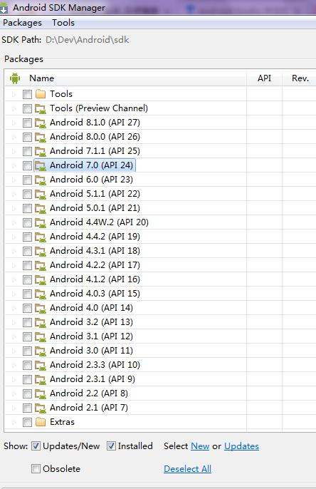

# Android01--搭建Android开发环境

标签： Android

---
[TOC]

## 搭建Android开发环境

### 下载JDK
JDK下载网址：Java SE Development Kit 8 - [Downloads](http://www.oracle.com/technetwork/java/javase/downloads/jdk8-downloads-2133151.html)  


jdk-8u101-windows-i586.exe：  
1) [jdk-8u101-windows-i586.exe](http://download.oracle.com/otn-pub/java/jdk/8u101-b13/jdk-8u101-windows-i586.exe)  
2) [jdk_8u101_windows_i586_8.0.1010.13.exe](http://sw.bos.baidu.com/sw-search-sp/software/11500c7bad2ed/jdk_8u101_windows_i586_8.0.1010.13.exe)  

[jdk-8u101-windows-x64.exe](http://download.oracle.com/otn-pub/java/jdk/8u101-b13/jdk-8u101-windows-x64.exe)  

[jdk-8u101-macosx-x64.dmg](http://download.oracle.com/otn-pub/java/jdk/8u101-b13/jdk-8u101-macosx-x64.dmg)  

### 下载Android Studio

[Android Studio 中文社区(官网)](http://www.android-studio.org/)  


**2.1完整版(包含IDE+Android SDK)：**  
链接1（1187 MB）： 官网 [android-studio-bundle-143.2915827-windows.exe](https://dl.google.com/dl/android/studio/install/2.1.2.0/android-studio-bundle-143.2915827-windows.exe)  
链接2（1187 MB）： 百度软件 [android_studio_2.1.0.0.exe](http://sw.bos.baidu.com/sw-search-sp/software/9de9eafde52ad/android_studio_2.1.0.0.exe)  
链接3（1187 MB）：百度云 [android-studio-bundle-143.2739321-windows.exe](http://pan.baidu.com/s/1qYVc6kc)  

**2.1 IDE版（不包含Android SDK）：**  
安装版（277 MB）：[android-studio-ide-143.2915827-windows.exe](https://dl.google.com/dl/android/studio/install/2.1.2.0/android-studio-ide-143.2915827-windows.exe)  
压缩版（293 MB）：[android-studio-ide-143.2915827-windows.zip](https://dl.google.com/dl/android/studio/ide-zips/2.1.2.0/android-studio-ide-143.2915827-windows.zip)  

Mac OS X（291 MB）：[android-studio-ide-143.2915827-mac.dmg](https://dl.google.com/dl/android/studio/install/2.1.2.0/android-studio-ide-143.2915827-mac.dmg)  

Linux（291 MB）：[android-studio-ide-143.2915827-linux.zip](https://dl.google.com/dl/android/studio/ide-zips/2.1.2.0/android-studio-ide-143.2915827-linux.zip)  

### Android SDK（可选）

如果下载了完整版的Android Studio，不用下载Android SDK。  

1) Windows  
安装版（144 MB）：[installer_r24.4.1-windows.exe](https://dl.google.com/android/installer_r24.4.1-windows.exe)  
解压版（190 MB）：[android-sdk_r24.4.1-windows.zip](https://dl.google.com/android/android-sdk_r24.4.1-windows.zip)  

2) Mac OS X  
[android-sdk_r24.4.1-macosx.zip](https://dl.google.com/android/android-sdk_r24.4.1-macosx.zip) 98 MB  

3) Linux  
[android-sdk_r24.4.1-linux.tgz](https://dl.google.com/android/android-sdk_r24.4.1-linux.tgz) 311 MB  

### 安装JDK
windows下直接傻瓜式安装，下一步，就可以了。  

配置环境变量：  
> 控制面板->高级系统设置->环境变量：系统变量  

1) 配置JAVA_HOME  
```
JAVA_HOME=C:\Program Files\Java\jdk1.8.0_101
```
路径是你安装好的jdk主目录。  

2) 配置CLASSPATH  
```
classpath=.;%JAVA_HOME%\lib;%JAVA_HOME%\lib\tools.jar
```
切记前面要带一个"."。  

3) 配置PATH  
直接在path后面添加即可，前面带的分号，用于跟原来的参数进行分隔。切勿把系统已有的删除了！  
```
;%JAVA_HOME%\bin;%JAVA_HOME%\jre\bin;
```

4)测试，看到版本表明安装成功  
```
$ java -version
java version "1.8.0_101"
Java(TM) SE Runtime Environment (build 1.8.0_101-b13)
Java HotSpot(TM) 64-Bit Server VM (build 25.101-b13, mixed mode)
```


### 使用IntelliJ IDEA搭建开发环境
可以使用JDK + IntelliJ IDEA + Android SDK 搭建开发环境。IntelliJ IDEA自带ADT。

### 使用eclipse搭建开发环境
可以使用JDK + eclipse + ADT + Android SDK 搭建开发环境。

## build.gradle文件介绍

Android Studio是采用Gradle来构建项目的，Gradle是一个非常先进的的项目于构建工具。使用Android Studio创建项目会生成两个build.gradle文件，一个是在最外层，一个是在app目录下的。这两个文件对构建Android Studio起到了至关重要的作用。

首先看最外层的build.gradle文件：
``` java
buildscript {
    repositories {
        jcenter()
    }
    dependencies {
        classpath 'com.android.tools.build:gradle:3.0.0'

        // NOTE: Do not place your application dependencies here; they belong
        // in the individual module build.gradle files
    }
}

allprojects {
    repositories {
        jcenter()
    }
}
```

这些代码是自动生成的。通常我们不需要去修改它。

其中`jcenter()`配置里的jcenter，其实是一个代码托管仓库，很多Android的开源项目都会选择托管到jcenter上。声明了这个配置，我们就可以引用jcenter上的开源项目了。

接下来`dependencies`使用`classpath`声明了`com.android.tools.build:gradle:3.0.0`，这是个Gradle插件。Gradle实际上并不是专门为构建安卓项目开发的，Java、C++等很多项目都可以使用Gradle来构建，这里声明`com.android.tools.build:gradle:3.0.0`，就是想用Gradle来构建安卓项目。其中`3.0.0`是该插件的版本号。

再来看app里面的build.gradle文件：
``` java
apply plugin: 'com.android.application'

android {
    compileSdkVersion 23
    buildToolsVersion "24.0.2"

    defaultConfig {
        applicationId "com.a52fhy.chat_view_demo"
        minSdkVersion 14
        targetSdkVersion 23
        versionCode 1
        versionName "1.0"
    }
    buildTypes {
        release {
            minifyEnabled false
            proguardFiles getDefaultProguardFile('proguard-android.txt'), 'proguard-rules.pro'
        }
    }
}

dependencies {
    compile fileTree(dir: 'libs', include: ['*.jar'])
    testCompile 'junit:junit:4.12'
    compile 'com.android.support:appcompat-v7:23.3.0'
}
```

该文件内容稍微多一些。
第一行`apply plugin`声明了`com.android.application`，说明这是一个程序模块。如果声明为`com.android.library`表示这是一个库模块，库模块不能直接运行，只能依附于别的应用程序模块来运行。

`compileSdkVersion`用于指定项目的编译版本，`23`表示这是使用Android 6.0的SDK编译。
`buildToolsVersion`用于指定项目构建工具的版本。

**defaultConfig里的配置：**  
`applicationId`是项目的包名。
`minSdkVersion`用于指定项目最低兼容的Android系统版本。这里指定`14`，说明最低兼容Android 4.0。
`targetSdkVersion`指定的值表名你已经在该目标版本上做了充分的测试，系统将会为你的应用程序启动一些最新的功能和特性。比如Android 6.0引入了运行时权限的功能，而如果你把`targetSdkVersion`指定为`22`，那么说明你的应用程序最高只在Android 5.1 系统上做过充分测试，Android 6.0引入的新功能自然不会启用了。
`versionCode`用于指定项目的版本号。
`versionName`用于指定项目的版本名。




**buildTypes里的配置：**  
这里面的配置用于配置生成安装文件的相关配置。通常自会有两个闭包，一个是`release`，一个是`debug`。`release`用于指定生成正式版安装文件的配置。`debug`是可以忽略不写的。
`minifyEnabled`是否对项目的代码进行混淆。
`proguardFiles`用于指定混淆的规则。`proguard-android.txt`是所有项目通用的混淆规则，位于Android SDK目录下。`proguard-rules.pro`是针对当前项目特殊的混淆规则，位于当前项目的根目录下。

**dependencies**：
用于指定当前项目的依赖关系。
`compile`声明的是**本地依赖**，它表示将`libs`目录下的的所有`.jar`格式的文件添加到当前项目的构建路径中。
`testCompile`声明测试用例库。
`compile`申明**远程依赖**。`com.android.support:appcompat-v7:23.3.0`就是一个标准的远程依赖格式，其中`com.android.support`是域名部分，用于和其它公司的库做区分；`appcompat-v7`是组名称，用于和同一公司不同的库做区分；`23.3.0`是版本号。加上这句声明后，Gradle在构建项目的时候，首先会检查本地是否有该库的缓存，如果没有的话会自动联网下载，然后会自动添加到当前项目的构建路径中。

还有一种依赖是**库依赖**，它的基本格式是`compile project(':helper')`，表示对helper库有依赖。


