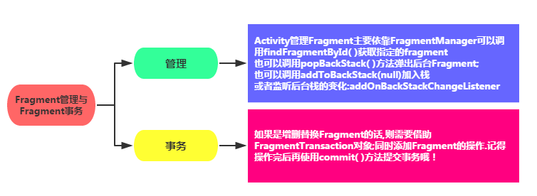

# Android09--Fragment

标签： Android

创建时间：2016-9-20 22:02:16
更新时间：2017-12-17 13:40:05

---
[TOC]

## 添加Fragment

相比于Activity，Fragment更轻量级。

> Fragment是Android3.0后引入的一个新的API，他出现的初衷是为了适应大屏幕的平板电脑， 当然现在他仍然是平板APP UI设计的宠儿，而且我们普通手机开发也会加入这个Fragment， 我们可以把他看成一个小型的Activity，又称Activity片段！想想，如果一个很大的界面，我们 就一个布局，写起界面来会有多麻烦，而且如果组件多的话是管理起来也很麻烦！而使用Fragment 我们可以把屏幕划分成几块，然后进行分组，进行一个模块化的管理！从而可以更加方便的在 运行过程中动态地更新Activity的用户界面！另外Fragment并不能单独使用，他需要嵌套在Activity 中使用，尽管他拥有自己的生命周期，但是还是会受到宿主Activity的生命周期的影响，比如Activity 被destory销毁了，他也会跟着销毁！


添加Fragment有两种方式，一种是静态加载Fragment，一种是动态加载Fragment。  

两种方式都得先编写Fragment的视图文件和类：  
1、视图文件和普通视图没什么区别：  
fragment_blank.xml
``` xml
<?xml version="1.0" encoding="utf-8"?>
<LinearLayout
    xmlns:android="http://schemas.android.com/apk/res/android" android:layout_width="match_parent"
    android:layout_height="match_parent">

    <TextView
        android:layout_width="match_parent"
        android:layout_height="match_parent"
        android:gravity="center"
        android:text="这是一个Fragment"/>

</LinearLayout>
```

2、编写Fragment类：

BlankFragment.java
``` java
package com.a52fhy.learnfragment;

import android.os.Bundle;
import android.app.Fragment;
import android.view.LayoutInflater;
import android.view.View;
import android.view.ViewGroup;

public class BlankFragment extends Fragment {

    @Override
    public View onCreateView(LayoutInflater inflater, ViewGroup container,Bundle savedInstanceState) {
        // Inflate the layout for this fragment
        View root =  inflater.inflate(R.layout.fragment_blank, container, false);
        return root;
    }
}

```
这里引入了`android.app.Fragment`里的Fragment类。`inflater.inflate(R.layout.fragment_blank, container, false)`用于解析视图。`R.layout.fragment_blank`是视图文件fragment_blank.xml，就是个普通的视图文件。  

3、接下来看如何在Activity里引用Fragment。引入就要区分静态加载还是动态加载了。  

静态加载：  
静态加载实际就是在Activity的视图里添加一个fragment标签，注意是小写的:
``` xml
<fragment
	android:layout_width="match_parent"
	android:layout_height="match_parent"
	android:name="com.a52fhy.learnlayout.BlankFragment"
	></fragment>
```
name属性是全限定类名哦，就是要包含Fragment的包名。
这样就可以加载这个Fragment了。

动态加载：
我们还可以在Activity里动态加载这个Fragment，只要在MainActivity的`onCreate()`里加上这句：
``` java
getFragmentManager().beginTransaction().add(R.id.container, new BlankFragment()).commit();
```
`getFragmentManager`用于获取Fragment管理器，然后开启事务，添加一个Fragment，最后提交事务。视图就被显示出来了。`R.id.container`是主布局的ID，我们可以为activity_main.xml的`LinearLayout`添加ID：
``` xml
android:id="@+id/container"
```

我们还可以在Fragment里使用另一个Fragment。示例：
``` java 
@Override
public View onCreateView(LayoutInflater inflater, ViewGroup container,
                         Bundle savedInstanceState) {
    // Inflate the layout for this fragment
    View root =  inflater.inflate(R.layout.fragment_blank, container, false);

    root.findViewById(R.id.btnOpenFgm2).setOnClickListener(new View.OnClickListener() {
        @Override
        public void onClick(View v) {

            getFragmentManager().beginTransaction()
                    .replace(R.id.container, new Blank2Fragment())
                    .addToBackStack(null)
                    .commit();

        }
    });

    return root;
}
```
值得说明的是，一是findViewById使用的是解析出来的root视图里的；二是使用`replace()`代替了`add()`，二者用法一致，一个是替换页面，一个是新增。

> 注意：
当`api>=14`时，使用`getFragmentManager()`。有时候使用Fragment的时候为了兼容低版本，会引入`android-support-v4.jar`支持包，这个时候，需要使用`getSupportFragmentManager()`。  

上面这段话说明，当我们使用默认的`android.app.Fragment`包时，使用`getFragmentManager()`即可；如果使用`android.support.v4.app.Fragment`包时，使用`getSupportFragmentManager()`。如果不用兼容旧版本，使用`android.app.Fragment`。

## Fragment生命周期


比较重要的是`onCreate()`、`onCreateView()`、`onPause()`。  

Fragment的生命周期和Activity有点类似：以下面三种状态举例说明:

- Resumed：在允许中的Fragment可见
- Paused：所在Activity可见,但是得不到焦点
- Stoped: 1)调用addToBackStack()，Fragment被添加到Bcak栈；2)该Activity转向后台，或者该Fragment被替换/删除。
停止状态的fragment仍然活着(所有状态和成员信息被系统保持着)，然而，它对用户不再可见，并且如果activity被杀掉，它也会被杀掉。

使用Fragment的一些要点：

- Fragment是3.0版本后引入，即 minSdk 要大于11。
- Fragment需要嵌套在Activity中使用，当然也可以嵌套到另外一个Fragment中,但这个被嵌套的Fragment也是需要嵌套在Activity中的。间接地说，Fragment还是需要嵌套在Activity中。Fragment受寄主Activity的生命周期影响，当然Fragment也有自己的生命周期。另外不建议在Fragment里面嵌套Fragment，因为嵌套在里面的Fragment生命周期不可控！
- 官方文档说创建Fragment时至少需要实现三个方法：onCreate()、onCreateView()、OnPause();不过实际上只写一个onCreateView也是可以的。


## Fragment管理与Fragment事务



## Fragment与Activity的交互


1、组件获取
1) Fragment获得Activity中的组件: `getActivity().findViewById(R.id.list)`；  
2) Activity获得Fragment中的组件(根据id和tag都可以)：`getFragmentManager.findFragmentByid(R.id.fragment1)`;

注意：
fragment无法直接进行点击事件，需要放到Fragment里的`oncreatActivity`中。示例：
``` java
public class BlankFragment extends Fragment {

    @Nullable
    @Override
    public View onCreateView(LayoutInflater inflater, @Nullable ViewGroup container, Bundle savedInstanceState) {
        super.onCreateView(inflater, container, savedInstanceState);
        View view = inflater.inflate(R.layout.fragment_blank, container, false);

        return  view;
    }

    @Override
    public void onActivityCreated(@Nullable Bundle savedInstanceState) {
        super.onActivityCreated(savedInstanceState);
        getActivity().findViewById(R.id.tv_fragment_1).setOnClickListener(new View.OnClickListener() {
            @Override
            public void onClick(View view) {
                Toast.makeText(getActivity(), "你点击了Fragment", Toast.LENGTH_LONG).show();
            }
        });
    }
}
```

2、数据传递
1) Activit传递数据给Fragment:
在Activity中创建`Bundle`数据包，调用Fragment实例的`setArguments(bundle)`从而将Bundle数据包传给Fragment，然后Fragment中调用`getArguments`获得`Bundle`对象,然后进行解析就可以了。示例：

MainActivity.java：
``` java
@Override
protected void onCreate(@Nullable Bundle savedInstanceState) {
	super.onCreate(savedInstanceState);
	setContentView(R.layout.activity_fragment);

	BlankFragment bf = new BlankFragment();
	Bundle bundle = new Bundle();
	bundle.putString("name", "yujc");
	bf.setArguments(bundle);//数据包

	getFragmentManager().beginTransaction().add(R.id.fragment_activity, bf).commit();

}
```

Fragment里获取数据：
``` java
@Override
public void onActivityCreated(@Nullable Bundle savedInstanceState) {
	super.onActivityCreated(savedInstanceState);

	Bundle bundle = getArguments();//获取Activity传过来的值
	String name = bundle.getString("name");
	Log.i("my_trace", name);
}
```

2) Fragment传递数据给Activity
在Fragment中定义一个内部回调接口，再让包含该Fragment的Activity实现该回调接口，Fragment就可以通过回调接口传数据了。

这段话意思不好理解，我们举例说明：

BlankFragment.java
``` java 
public class BlankFragment extends Fragment {

    @Nullable
    @Override
    public View onCreateView(LayoutInflater inflater, @Nullable ViewGroup container, Bundle savedInstanceState) {
        super.onCreateView(inflater, container, savedInstanceState);
        View view = inflater.inflate(R.layout.fragment_blank, container, false);
        return  view;
    }

	/*接口回调*/
    public void getData(CallBack callBack) {
        callBack.getResult("test");
    }

    /*接口*/
    public interface CallBack{
        /*定义一个获取信息的方法*/
        public void getResult(String result);
    }
}
```
我们现在Fragment里新增一个CallBack接口，里面有一个待重写的方法`getResult`用于获取返回的值。

再来看Activity：
``` java
protected void onCreate(@Nullable Bundle savedInstanceState) {
	super.onCreate(savedInstanceState);
	setContentView(R.layout.activity_fragment);

	BlankFragment bf = new BlankFragment();

	getFragmentManager().beginTransaction().add(R.id.fragment_activity, bf).commit();

	//调用了Fragment里的getData方法，并实例化了在Fragment里定义的接口CallBack里的方法
	bf.getData(new BlankFragment.CallBack() {
		@Override
		public void getResult(String result) {
			Log.i("my_trace", result);
		}
	});
}
```
Fragment加载后，我们调用了Fragment里的getData方法，并实例化了在Fragment里定义的接口CallBack里的方法。而在Fragment里，我们在getData方法里给回调传了值，所以我们能在Activity里获取到：

```
12-17 14:50:43.926 21612-21612/com.a52fhy.learnlayout I/my_trace: test
```


>参考：
1、getFragmentManager()和getSupportFragmentManager()区别 - eclothy的专栏  
2、http://blog.csdn.net/eclothy/article/details/41908009
[整] Android Fragment 生命周期图  
http://www.cnblogs.com/purediy/p/3276545.html


