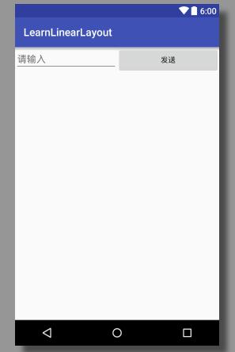
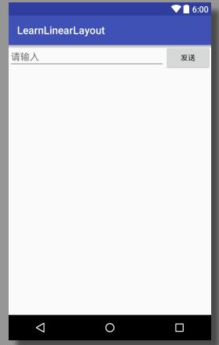
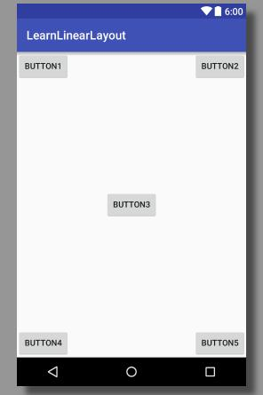
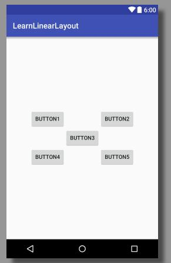
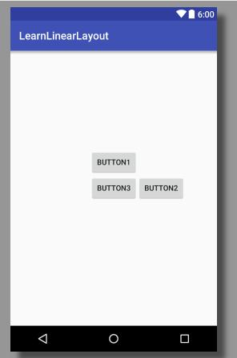
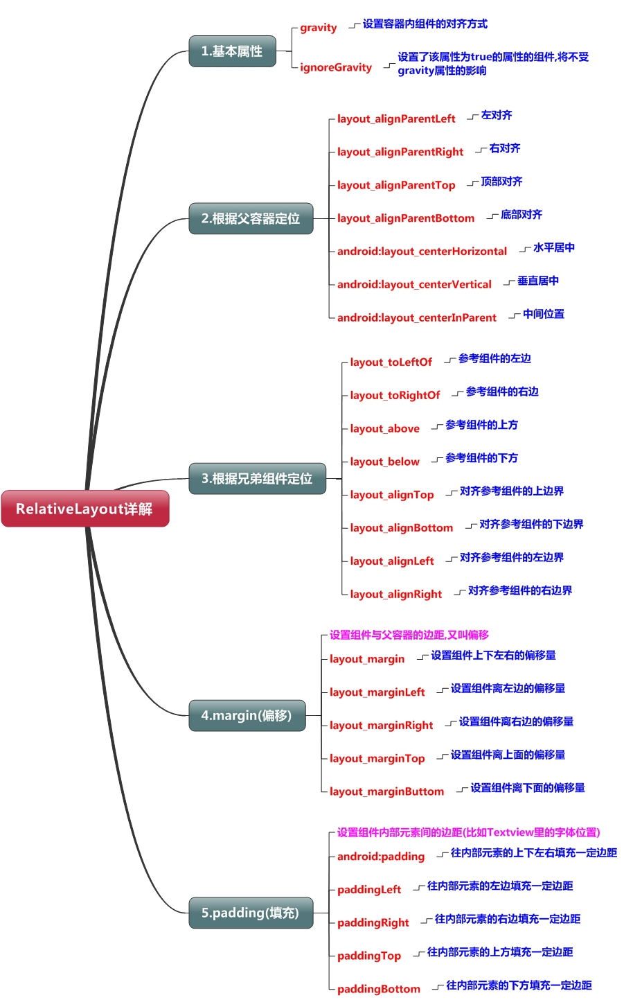
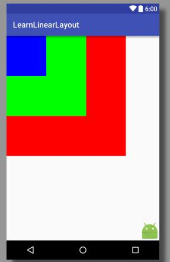
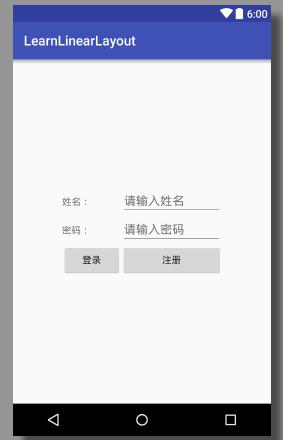
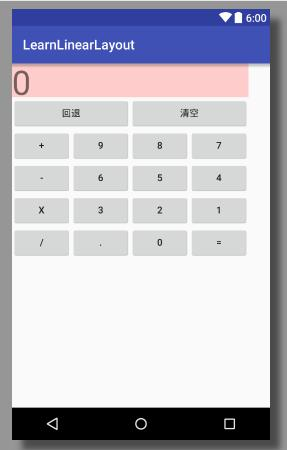
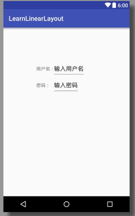

# Android11--基本布局

标签： Android

创建时间：2016-9-24 14:49:37  
更新时间：2016-9-24 20:42:35

---

[TOC]

Android中有四种最基本的布局：LinearLayout、RelativeLayout、FrameLayout、TableLayout。

## LinearLayout 线性布局
LinearLayout又称作线性布局，是一种非常常用的布局。正如它名字所描述的一样，这个布局会将它所包含的控件在线性方向上依次排列。  

我们可以通过`android:orientation`属性指定布局的排列方向。vertical是垂直方向，horizontal是水平方向。  

示例：按钮垂直方向排列：
``` xml
<?xml version="1.0" encoding="utf-8"?>
<LinearLayout xmlns:android="http://schemas.android.com/apk/res/android"
    xmlns:tools="http://schemas.android.com/tools"
    android:layout_width="match_parent"
    android:layout_height="match_parent"
    android:orientation="vertical"
    tools:context="com.a52fhy.learnwidget.MainActivity">
    
    <Button
        android:id="@+id/button1"
        android:layout_width="wrap_content"
        android:layout_height="wrap_content"
        android:layout_gravity="center"
        android:text="Button1"/>

    <Button
        android:id="@+id/button2"
        android:layout_width="match_parent"
        android:layout_height="wrap_content"
        android:gravity="center"
        android:text="Button2"/>

</LinearLayout>
```
上面展示了两个垂直排列的按钮。按钮1水平居中；按钮2宽度100%，文字居中。    

这里演示了LinearLayout中的一个重要属性：`android:gravity`，细心的你会发现还有个`android:layout_gravity`。都表示排列方向，区别在于`android:gravity`设置的是控件自身上面的内容位置（例如文字居中）；`android:layout_gravity`则是设置控件本身相对于父控件的显示位置（例如控件居中）。  

LinearLayout中的另一个重要属性是`android:layout_weight`（比重）。这个属性允许我们使用比例的方式来指定控件的大小，它在手机屏幕的适配性方面可以起到非常重要的作用。     

示例：
``` xml
<?xml version="1.0" encoding="utf-8"?>
<LinearLayout xmlns:android="http://schemas.android.com/apk/res/android"
    android:layout_width="match_parent"
    android:layout_height="wrap_content"
    android:orientation="horizontal">

    <EditText
        android:layout_width="0dp"
        android:layout_height="wrap_content"
        android:hint="请输入"
        android:layout_weight="1"/>

    <Button
        android:layout_width="0dp"
        android:layout_height="wrap_content"
        android:text="发送"
        android:layout_weight="1"/>
</LinearLayout>
```


上面的布局里，我们给控件设置宽度都设置为0，但比重是1:1。系统会先把`LinearLayout`下所有控件指定的`layout_weight`值相加，得到一个总值，然后每个控件所占大小的比例就是用该控件的`layout_weight`值除以刚才算出的总值。呈现的效果是`EditText`占宽度`1/2`，`Button`占宽度`1/2`。

如果我们把上面的例子改一下，把发送按钮改为：
``` xml
<Button
	android:layout_width="wrap_content"
	android:layout_height="wrap_content"
	android:text="发送"/>
```

这时候显示的效果是：


这里我们仅指定了`EditText的android:layout_weight`属性，并将Button的宽度改回`wrap_content`。这表示Button的宽度仍然按照`wrap_content`来计算，而`EditText`则会占满屏幕所有的剩余空间。


## RelativeLayout 相对布局
RelativeLayout是相对布局的意思。和LinearLayout的排列规则不同，RelativeLayout显得更加随意一些，它可以通过相对定位的方式让控件出现在布局的任何位置。也正因为如此，RelativeLayout中的属性非常多，不过这些属性都是有规律可循的，其实并不难理解和记忆。

### 相对于父布局
示例1：相对于父布局：
``` xml
<?xml version="1.0" encoding="utf-8"?>
<RelativeLayout xmlns:android="http://schemas.android.com/apk/res/android"
    android:orientation="vertical"
    android:layout_width="match_parent"
    android:layout_height="match_parent">

    <Button
        android:layout_width="wrap_content"
        android:layout_height="wrap_content"
        android:layout_alignParentTop="true"
        android:layout_alignParentLeft="true"
        android:text="Button1"/>

    <Button
        android:layout_width="wrap_content"
        android:layout_height="wrap_content"
        android:layout_alignParentTop="true"
        android:layout_alignParentRight="true"
        android:text="Button2"/>

    <Button
        android:layout_width="wrap_content"
        android:layout_height="wrap_content"
        android:layout_centerInParent="true"
        android:text="Button3"/>

    <Button
        android:layout_width="wrap_content"
        android:layout_height="wrap_content"
        android:layout_alignParentBottom="true"
        android:layout_alignParentLeft="true"
        android:text="Button4"/>

    <Button
        android:layout_width="wrap_content"
        android:layout_height="wrap_content"
        android:layout_alignParentBottom="true"
        android:layout_alignParentRight="true"
        android:text="Button5"/>

</RelativeLayout>
```
以上代码实现了5个按钮分别位于屏幕左上角、右上角、居中、左下角、右下角。



用到了如下几个属性组合：  
``` xml
android:layout_alignParentTop="true" 位于顶部
android:layout_alignParentBottom="true" 位于底部
android:layout_alignParentLeft="true" 位于左边
android:layout_alignParentRight="true" 位于右边
android:layout_centerInParent="true" 居中

# 另外
android:layout_centerHorizontal="true" 水平居中
android:layout_centerVertical="true" 竖直居中
```
以上结果属性都是相当于父布局而言的，属性名字已经表达了这一点。这几个属性的值只有true和false。通过组合，可以定位到各个方向。  

### 相对于兄弟控件
示例2：相对于兄弟控件：
``` xml
<?xml version="1.0" encoding="utf-8"?>
<RelativeLayout xmlns:android="http://schemas.android.com/apk/res/android"
    android:orientation="vertical"
    android:layout_width="match_parent"
    android:layout_height="match_parent">

    <Button
        android:layout_width="wrap_content"
        android:layout_height="wrap_content"
        android:layout_above="@id/btn3"
        android:layout_toLeftOf="@id/btn3"
        android:text="Button1"/>

    <Button
        android:layout_width="wrap_content"
        android:layout_height="wrap_content"
        android:layout_above="@id/btn3"
        android:layout_toRightOf="@id/btn3"
        android:text="Button2"/>

    <Button
        android:layout_width="wrap_content"
        android:layout_height="wrap_content"
        android:layout_centerInParent="true"
        android:id="@+id/btn3"
        android:text="Button3"/>

    <Button
        android:layout_width="wrap_content"
        android:layout_height="wrap_content"
        android:layout_below="@id/btn3"
        android:layout_toLeftOf="@id/btn3"
        android:text="Button4"/>

    <Button
        android:layout_width="wrap_content"
        android:layout_height="wrap_content"
        android:layout_below="@id/btn3"
        android:layout_toRightOf="@id/btn3"
        android:text="Button5"/>

</RelativeLayout>
```
以上代码实现了5个按钮分别位于按钮3的左上角、右上角、居中、左下角、右下角。



用到了如下几个属性组合：  
``` xml
android:layout_above="@id/btn3" 相对于控件上面
android:layout_below="@id/btn3" 相对于控件下面
android:layout_toLeftOf="@id/btn3" 相对于控件左边
android:layout_toRightOf="@id/btn3" 相对于控件右边
```
这几个属性的值是控件的id，组合使用。   

除了上面的几个属性，相对于兄弟控件还有：
``` xml
android:layout_alignTop="@id/btn3" 表示让一个控件的上边缘和另一个控件的上边缘对齐
android:layout_alignBottom="@id/btn3" 表示让一个控件的下边缘和另一个控件的下边缘对齐
android:layout_alignLeft="@id/btn3" 表示让一个控件的左边缘和另一个控件的左边缘对齐
android:layout_alignRight="@id/btn3" 表示让一个控件的右边缘和另一个控件的右边缘对齐
```

下面举例说明：

示例3：
``` xml
<?xml version="1.0" encoding="utf-8"?>
<RelativeLayout xmlns:android="http://schemas.android.com/apk/res/android"
    android:orientation="vertical"
    android:layout_width="match_parent"
    android:layout_height="match_parent">

    <Button
        android:layout_width="wrap_content"
        android:layout_height="wrap_content"
        android:layout_above="@id/btn3"
        android:layout_alignLeft="@id/btn3"
        android:text="Button1"/>

    <Button
        android:layout_width="wrap_content"
        android:layout_height="wrap_content"
        android:layout_alignTop="@id/btn3"
        android:layout_toRightOf="@id/btn3"
        android:text="Button2"/>

    <Button
        android:layout_width="wrap_content"
        android:layout_height="wrap_content"
        android:layout_centerInParent="true"
        android:id="@+id/btn3"
        android:text="Button3"/>

</RelativeLayout>
```



### 外边距
设置组件与父布局的偏移。

``` xml
android:layout_margin="10dp" 相对于父布局上下左右偏移，都是10dp，只有一个值
android:layout_marginLeft="10dp" 相对于父布局左偏移
android:layout_marginRight="10dp" 相对于父布局右偏移
android:layout_marginTop="10dp" 相对于父布局上偏移
android:layout_marginBottom="10dp" 相对于父布局下偏移
```

注意：margin可以设置为负数。

### 内边距
设置组件内部元素间的偏移。

``` xml
android:layout_padding="10dp" 往内部元素上下左右填充边距，都是10dp，只有一个值
android:layout_paddingLeft="10dp" 往内部元素左填充边距
android:layout_paddingRight="10dp" 往内部元素右填充边距
android:layout_paddingTop="10dp" 往内部元素上填充边距
android:layout_paddingBottom="10dp" 往内部元素下填充边距
```




## FrameLayout 帧布局
FrameLayout相比于前面两种布局就简单太多了，因此它的应用场景也少了很多。  

这种布局没有任何的定位方式，所有的控件都会摆放在布局的左上角。 虽然默认会将控件放置在左上角,但是我们也可以通过`layout_gravity`属性,指定到其他的位置。

FrameLayout的属性很少就两个,但是在说之前我们先介绍一个东西:  
`前景图像`:永远处于帧布局最上面,直接面对用户的图像,就是不会被覆盖的图片。  

两个属性:
```
android:foreground: 设置改帧布局容器的前景图像
android:foregroundGravity: 设置前景图像显示的位置
```

示例：
``` xml
<?xml version="1.0" encoding="utf-8"?>
<FrameLayout xmlns:android="http://schemas.android.com/apk/res/android"
    android:orientation="vertical" android:layout_width="match_parent"
    android:layout_height="match_parent"
    android:foreground="@mipmap/ic_launcher"
    android:foregroundGravity="bottom|right">

    <TextView
        android:layout_width="300dp"
        android:layout_height="300dp"
        android:background="#ff0000"/>

    <TextView
        android:layout_width="200dp"
        android:layout_height="200dp"
        android:background="#0f0"/>

    <TextView
        android:layout_width="100dp"
        android:layout_height="100dp"
        android:background="#00f"/>

</FrameLayout>
```
以上代码实现将三个TextView设置不同大小与背景色,依次覆盖,接着右下角的是前景图像,通过 `android:foreground` 设置前景图像的图片， `android:foregroundGravity` 设置前景图像的位置在右下角。




## TableLayout 表格布局
TableLayout允许我们使用表格的方式来排列控件，这种布局也不是很常用。

三个常用属性:
``` xml
android:collapseColumns:设置需要被隐藏的列的序号
android:shrinkColumns:设置允许被收缩的列的列序号
android:stretchColumns:设置运行被拉伸的列的列序号
```
以上这三个属性的列号都是从0开始算的,比如`shrinkColunmns = "2"`,对应的是第三列。可以设置多个,用逗号隔开比如`"0,2"`,如果是所有列都生效,则用`"*"`号即可。  


除了这三个常用属性,还有两个属性,分别就是跳格子以及合并单元格,这和HTML中的Table类似:
```
android:layout_column="2":表示的就是跳过第二个,直接显示到第三个格子处,从1开始算的!
android:layout_span="4":表示合并4个单元格,也就说这个组件占4个单元格
```

与html的table相比，TableLayout有`TableRow`对应html的`<tr>`标签，但是没有与`<td>`对应的标签。也就是说，有多少个`TableRow`，就有多少行；至于列数，则由该列中最宽的单元格（由控件组成）决定。

示例
```xml
<?xml version="1.0" encoding="utf-8"?>
<TableLayout xmlns:android="http://schemas.android.com/apk/res/android"
    android:orientation="vertical"
    android:layout_width="match_parent"
    android:layout_height="match_parent"
    android:gravity="center_vertical"
    android:stretchColumns="0,3"
    >

    <TableRow>
        <TextView />
        <TextView
            android:layout_width="wrap_content"
            android:layout_height="wrap_content"
            android:text="姓名："/>

        <EditText
            android:layout_width="wrap_content"
            android:layout_height="wrap_content"
            android:hint="请输入姓名"
            android:minWidth="150dp"/>
        <TextView />
    </TableRow>

    <TableRow>
        <TextView />
        <TextView
            android:layout_width="wrap_content"
            android:layout_height="wrap_content"
            android:text="密码："/>

        <EditText
            android:layout_width="wrap_content"
            android:layout_height="wrap_content"
            android:inputType="textPassword"
            android:hint="请输入密码"
            android:minWidth="150dp"/>
        <TextView />
    </TableRow>

    <TableRow>
        <TextView />
        <Button
            android:layout_width="wrap_content"
            android:layout_height="wrap_content"
            android:text="登录"/>

        <Button
            android:layout_width="wrap_content"
            android:layout_height="wrap_content"
            android:text="注册"/>
        <TextView />
    </TableRow>

</TableLayout>
```
以上代码实现了简单的登录注册界面。每行4列，其中第1和第4列设置为可拉伸，用于拉伸填满该行，这样可以让表格水平居中。父布局调用`gravity`属性,设置为`center_vertical`,让布局里面的组件在竖直方向上居中。




## GridLayout 网格布局
GridLayout是Android 4.0以后引入的一个新的布局,和TableLayout有点类似。相比TableLayout，GridLayout更好用。  

属性：
```
android:rowCount="6" 设置行数
android:columnCount="4" 设置列数

android:layout_rowSpan="2" 设置横跨行数
android:layout_columnSpan="2" 设置横跨列数

android:layout_row="1" 设置组件位于第2行
android:layout_column="1" 设置组件位于第2列
```

示例：
``` xml
<?xml version="1.0" encoding="utf-8"?>
<GridLayout xmlns:android="http://schemas.android.com/apk/res/android"
    android:orientation="horizontal"
    android:layout_width="wrap_content"
    android:layout_height="wrap_content"
    android:rowCount="6"
    android:columnCount="4">

    <TextView
        android:layout_columnSpan="4"
        android:layout_height="50dp"
        android:background="#ffcccc"
        android:text="0"
        android:textSize="50sp"
        android:layout_gravity="fill"/>

    <Button
        android:layout_columnSpan="2"
        android:layout_gravity="fill"
        android:text="回退"/>

    <Button
        android:layout_columnSpan="2"
        android:layout_gravity="fill"
        android:text="清空"/>

    <Button android:text="+" />
    <Button android:text="9" />
    <Button android:text="8" />
    <Button android:text="7" />
    <Button android:text="-" />
    <Button android:text="6" />
    <Button android:text="5" />
    <Button android:text="4" />
    <Button android:text="x" />
    <Button android:text="3" />
    <Button android:text="2" />
    <Button android:text="1" />
    <Button android:text="/" />
    <Button android:text="." />
    <Button android:text="0" />
    <Button android:text="=" />

</GridLayout>
```
以上代码实现了简单的计算器界面。使用6行4列布局，其中第一行设置`android:layout_columnSpan="4"`横跨4列，并使用`android:layout_gravity="fill"`填充宽度。    




注意：如果你要让组件填满横越过的行或列的话,一定要添加下面这个属性:
```
android:layout_gravity = "fill"
```


## AbsoluteLayout 绝对布局
AbsoluteLayout我们基本上都是不会使用的，因为使用的绝对布局不能适应各种机型，这个布局官方已经不推荐使用了。  

主要使用四大控制属性(单位都是dp):
```
# 控制大小: 
android:layout_width:组件宽度 
android:layout_height:组件高度 

# 控制位置: 
android:layout_x:设置组件的X坐标 
android:layout_y:设置组件的Y坐标
```

示例：
``` xml
<?xml version="1.0" encoding="utf-8"?>
<AbsoluteLayout xmlns:android="http://schemas.android.com/apk/res/android"
    android:orientation="vertical" android:layout_width="match_parent"
    android:layout_height="match_parent">

    <TextView
        android:layout_width="wrap_content"
        android:layout_height="50dp"
        android:layout_x="100dp"
        android:layout_y="100dp"
        android:gravity="center"
        android:text="用户名："/>

    <EditText
        android:layout_width="wrap_content"
        android:layout_height="50dp"
        android:layout_x="150dp"
        android:layout_y="100dp"
        android:text="输入用户名"/>

    <TextView
        android:layout_width="wrap_content"
        android:layout_height="50dp"
        android:layout_x="100dp"
        android:layout_y="150dp"
        android:gravity="center"
        android:text="密码："/>

    <EditText
        android:layout_width="wrap_content"
        android:layout_height="50dp"
        android:layout_x="150dp"
        android:layout_y="150dp"
        android:text="输入密码"/>

</AbsoluteLayout>
```



### ConstraintLayout

ConstraintLayout 即约束布局，是谷歌最近推出的一种新布局，关于他的基本用法，网上也有不少的教程了。可以参照：
Android ConstraintLayout详解 - 简书
http://www.jianshu.com/p/a8b49ff64cd3

使用ConstraintLayout构建一个灵活的布局 - CSDN博客
http://blog.csdn.net/maplejaw_/article/details/52624960

## 总结
介绍了这么多布局，但平时开发建议使用：LinearLayout的weight比重属性+ RelativeLayout来构建我们的界面。


