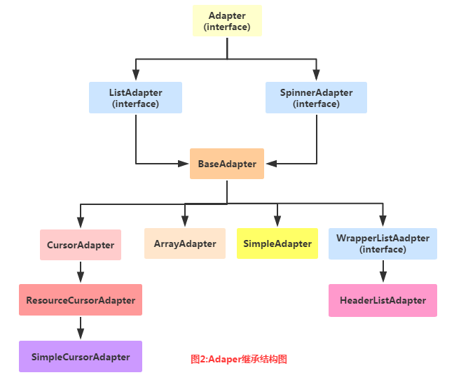

# Android14--Adapter

标签： Android


---

[TOC]

Adapter继承结构图：


实际开发中用到的几个Adapter：

- BaseAdapter：抽象类，实际开发中我们会继承这个类并且重写相关方法，用得最多的一个Adapter！
- ArrayAdapter：支持泛型操作，最简单的一个Adapter，只能展现一行文字；
- SimpleAdapter：同样具有良好扩展性的一个Adapter，可以自定义多种效果；
- SimpleCursorAdapter：用于显示简单文本类型的listView，一般在数据库那里会用到，不过有点过时， 不推荐使用！

其实一个BaseAdapter就够了，至于其他的，实际开发中用得不多。

## 简单示例
下面将使用ArrayAdapter作为示例：
先创建一个listview:
``` xml
<ListView
        android:id="@+id/lv"
        android:layout_width="match_parent"
        android:layout_height="match_parent"></ListView>
```

主要代码：
``` java
@Override
protected void onCreate(Bundle savedInstanceState) {
	super.onCreate(savedInstanceState);
	setContentView(R.layout.activity_main);

	//data
	String[] city_list = {"北京", "广州", "上海", "武汉", "天津", "重庆" ,"深圳"};

	//创建ArrayAdapter
	ArrayAdapter<String> adapter = new ArrayAdapter<String>(MainActivity.this, android.R.layout.simple_expandable_list_item_1, city_list);

	//获取ListView对象，通过调用setAdapter方法为ListView设置Adapter设置适配器
	ListView lv = (ListView) findViewById(R.id.lv);
	lv.setAdapter(adapter);
}
```

实例化ArrayAdapter需要传入context、使用的布局模板文件、数据。`android.R.layout.simple_expandable_list_item_1`是安卓内置的一个布局模板文件，当前还有其它的：

simple_list_item_1 : 单独一行的文本框  
simple_list_item_2 : 两个文本框组成   
simple_list_item_checked : 每项都是由一个已选中的列表项  simple_list_item_multiple_choice : 都带有一个复选框  
simple_list_item_single_choice : 都带有一个单选钮 

## 通过数组资源文件读取数据
上面我们在java代码里使用数组代表列表内容。我们也可以使用数组资源文件：
在`res\valuse`下创建一个数组资源的xml文件：arrays.xml：
``` xml
<?xml version="1.0" encoding="utf-8"?>
<resources>
    <string-array name="city_list">
        <item>北京</item>
        <item>广州</item>
        <item>上海</item>
        <item>武汉</item>
        <item>天津</item>
        <item>重庆</item>
        <item>深圳</item>
    </string-array>
</resources>
```

我们只需要将java代码里创建ArrayAdapter代码替换为：
``` java
ArrayAdapter<CharSequence> adapter = ArrayAdapter.createFromResource(MainActivity.this,
                R.array.city_list,
                android.R.layout.simple_expandable_list_item_1);
```
即可。

## SimpleAdapter使用示例


