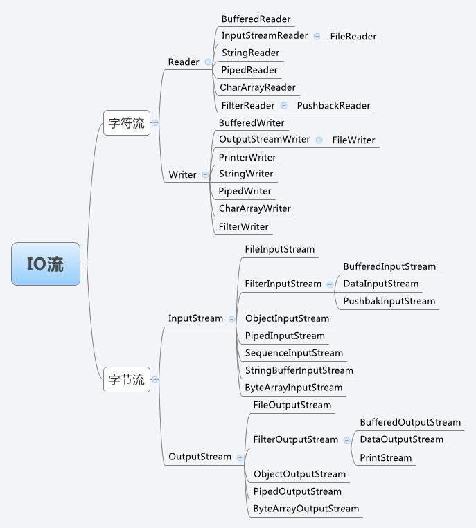

# Java 流(Stream)、文件(File)和IO

更新时间：2018-1-7 12:27:21

---

[TOC]

`java.io` 包几乎包含了所有操作输入、输出需要的类。所有这些流类代表了输入源和输出目标。

## 输入输出流

### 简介

一个流被定义为一个数据序列。输入流用于从源读取数据，输出流用于向目标写数据。

下图是一个描述输入流和输出流的类层次图：



在`java.io`包中操作文件内容的主要有两大类：字节流、字符流，两类都分为输入和输出操作。

在字节流中输出数据主要是使用`OutputStream`完成，输入使的是`InputStream`；在字符流中输出主要是使用`Writer`类完成，输入流主要使用`Reader`类完成。这四个都是抽象类。

java中提供了专用于输入输出功能的包`java.io`, 其中包括：

- `InputStream`, `OutputStream`, `Reader`, `Writer`。
- `InputStream`和`OutputStream`, 两个是为字节流设计的,主要用来处理字节或二进制对象。
- `Reader`和`Writer`, 两个是为字符流（1个字符占2个字节）设计的,主要用来处理字符或字符串。

常见的`System.in`其实就是InputStream对象。


### 字节流转换为字符流

为了方便处理字节流，我们经常会把字节流转换为字符流。例如：

Java 的控制台输入由 `System.in` 完成。为了获得一个绑定到控制台的字符流，我们可以把 `System.in` 包装在一个 `BufferedReader `对象中来创建一个字符流。

下面是创建 `BufferedReader` 的基本语法：
``` java 
BufferedReader br = new BufferedReader(new InputStreamReader(System.in));
```

同理，从文件读取：
``` java 
InputStream f = new FileInputStream("C:/java/hello");
BufferedReader br = new BufferedReader(new InputStreamReader(f));
```

使用BufferedReader是为了使用缓冲功能。
> `java.io.BufferedReader`和`java.io.BufferedWriter`类各拥有8192字符的缓冲区。当`BufferedReader`在读取文本文件时，会先尽量从文件中读入字符数据并置入缓冲区，而之后若使用`read()`方法，会先从缓冲区中进行读取。如果缓冲区数据不足，才会再从文件中读取，使用`BufferedWriter`时，写入的数据并不会先输出到目的地，而是先存储至缓冲区中。如果缓冲区中的数据满了，才会一次对目的地进行写出。

针对上面示例的三个类进行简单说明：
- `InputStream`：是所有字节输入流的超类，一般使用它的子类：`FileInputStream`等，它能输出字节流；
- `InputStreamReader`：是字节流与字符流之间的桥梁，能将字节流输出为字符流，并且能为字节流指定字符集，可输出一个个的字符；
- `BufferedReader`：提供通用的缓冲方式文本读取，`readLine()`读取一个文本行，从字符输入流中读取文本，缓冲各个字符，从而提供字符、数组和行的高效读取。

`InputStream`提供的`read()`方法支持从输入流中读取一个数据字节。常用原型：
``` java
public int read() throws IOException {}
```
从此输入流中读取一个数据字节。如果没有输入可用，则此方法将阻塞。 
指定者：类 InputStream 中的 read
返回：下一个数据字节；如果已到达文件末尾，则返回 -1。

``` java
public int read(byte[] b) throws IOException{}
```
从此输入流中将最多 b.length 个字节的数据读入一个 byte 数组中。在某些输入可用之前，此方法将阻塞。 
覆盖：类 InputStream 中的 read
参数：存储读取数据的缓冲区。 
返回：读入缓冲区的字节总数，如果因为已经到达文件末尾而没有更多的数据，则返回 -1。 


### 示例

#### 示例1：从控制台读取单字符输入
``` java
public static void main(String[] args) throws IOException{
	BufferedReader br = new BufferedReader(new InputStreamReader(System.in));
	char c;
	
	System.out.println("输入字符,按下 'q' 键退出:");
	
	do {
		c = (char) br.read();
		System.out.println(c);
	}while(c != 'q');
}
```

#### 示例2：从控制台读取多字符输入
``` java
public static void main(String[] args) throws IOException{
	BufferedReader br = new BufferedReader(new InputStreamReader(System.in));
	String s;
	System.out.println("输入字符串,按下 'quit' 键退出:");
	
	do {
		s = br.readLine();
		System.out.println(s);
	}while(!s.equals("quit"));
}
```

#### 示例3：使用 InputStream 中的 read读取字节流
``` java
public static void main(String[] args) throws IOException{
	InputStream input = System.in;
	byte[] b = new byte[1024];
	int len = 0;
	StringBuffer sb = new StringBuffer("");

	while ((len = input.read(b)) != 2) {
		System.out.println(len);
		sb.append(new String(b, 0, len));
	}
	
	input.close();
	System.out.println(sb.toString());
}
```

其实该例子改成文件读取会更好：
``` java
public static void main(String[] args) throws IOException{
	InputStream input = new FileInputStream("src/test.txt");
	byte[] b = new byte[1024];
	int len = 0;
	StringBuffer sb = new StringBuffer("");

	while ((len = input.read(b)) > 0) {
		System.out.println(len);
		sb.append(new String(b, 0, len));
	}
	
	input.close();
	System.out.println(sb.toString());
}
```

也可以使用一个文件对象来创建一个输入流对象来读取文件。我们首先得使用 `File()` 方法来创建一个文件对象：
``` java
File f = new File("src/test.txt");
InputStream input = new FileInputStream(f);
```

必须先在src目录下建立文件`test.txt`，内容: hello world
运行结果：
```
11
hello world
```

#### 示例4：控制台输出：
我们知道，控制台的输出由 `print()` 和 `println()` 完成。这些方法都由类 `PrintStream` 定义，`System.out` 是该类对象的一个引用。
`PrintStream` 继承了 `OutputStream`类，并且实现了方法 `write()`。这样，`write()` 也可以用来往控制台写操作。
但是`write()` 方法不经常使用，因为 `print()` 和 `println()` 方法用起来更为方便。

`PrintStream` 定义 `write()` 的最简单格式如下所示：
``` java
void write(int byteval){}
```
该方法将 `byteval` 的低八位字节写到流中。

``` java
public static void main(String[] args) {
	System.out.write('h');
	System.out.write('\n');
}
```

#### 示例5：输出内容到文件
``` java
public static void main(String[] args) throws IOException{
		
	String str = "hello world";
	
	// 构建FileOutputStream对象,文件不存在会自动新建
	OutputStream out = new FileOutputStream("src/test2.txt");
	out.write(str.getBytes());
	out.close();
}
```

也可以使用一个文件对象来创建一个输出流来写文件。我们首先得使用`File()`方法来创建一个文件对象：
``` java
File f = new File("src/test2.txt");
OutputStream out = new FileOutputStream(f);
```

运行后，打开`src`目，就能看到test2.txt。

`getBytes()`用于把字符串转化为字节流（byte型）。方法原型：
``` java
public byte[] getBytes() {
	return StringCoding.encode(value, 0, value.length);
}

public byte[] getBytes(Charset charset) {
	if (charset == null) throw new NullPointerException();
	return StringCoding.encode(charset, value, 0, value.length);
}
```

#### 示例6：借助BufferedWriter输出内容到文件
``` java
public static void main(String[] args) throws IOException{
		
	String str = "hello";
	
	// 构建FileOutputStream对象,文件不存在会自动新建
	OutputStream out = new FileOutputStream("src/test3.txt");
	BufferedWriter bWriter = new BufferedWriter(new OutputStreamWriter(out));
    bWriter.write(str);
	bWriter.close();//关闭缓冲区
}
``` 

我们还可以结合上述的BufferedReader进行从键盘输入，保存到文件：
``` java
public static void main(String[] args) throws IOException{
		
	String str = "";
	
	// 构建FileOutputStream对象,文件不存在会自动新建
	OutputStream out = new FileOutputStream("src/test3.txt");
	BufferedWriter bWriter = new BufferedWriter(new OutputStreamWriter(out, "utf-8"));//构建OutputStreamWriter对象,参数可以指定编码,默认为操作系统默认编码,windows上是gbk
//		bWriter.write(str);
	
	//读缓存区
	BufferedReader br = new BufferedReader(new InputStreamReader(System.in));
	
	do {
		str = br.readLine();
		bWriter.write(str);
		System.out.println(str);
	}while(!str.equals("quit"));
	
	bWriter.close();//关闭缓冲区,同时会把缓冲区内容写入文件
	out.close();// 关闭输出流,释放系统资源
}
```

## 文件和I/O

主要有这些类：

- [File](http://www.runoob.com/java/java-file.html) 文件类。
- [FileReader](http://www.runoob.com/java/java-filereader.html) FileReader类从`InputStreamReader`类继承而来。该类按字符读取流中数据。
- [FileWriter](http://www.runoob.com/java/java-filewriter.html) FileWriter 类从 `OutputStreamWriter `类继承而来。该类按字符向流中写入数据。


`File` 类至少有一个参数。`File` 类方法：

- `mkdir()`方法创建一个文件夹，成功则返回true，失败则返回false。
失败表明File对象指定的路径已经存在，或者由于整个路径还不存在，该文件夹不能被创建。
- `mkdirs()`创建指定的目录，包括创建必需但不存在的父目录。创建多级目录使用该方法。
- `isDirectory()`判断是否是一个目录。
- `isFile()` 判断是否是一个标准文件。
- `list()` 提取包含的文件和文件夹的列表。
- `delete()`方法同于删除文件或空目录。
- `createNewFile() throws IOException`
当且仅当不存在具有此抽象路径名指定的名称的文件时，原子地创建由此抽象路径名指定的一个新的空文件。

示例1：目录操作
``` java
public static void main(String[] args) throws IOException {
	String dirname = "src/tmp";
	File file = new File(dirname);
	
	//创建目录
	if(!file.isDirectory()) {
		if(file.mkdirs()) {
			System.out.println("succ mkdirs");
		}
	}
	
	//创建文件
	File file2 = new File(dirname + "/test.txt");
	file2.createNewFile();//目录必须存在
	
	File file3 = new File(dirname + "/test/");
	file3.mkdir();
	
	//列出目录
	if(file.isDirectory()) {
		String[] lists = file.list();
		for (int i = 0; i < lists.length; i++) {
			File f = new File(dirname + "/" + lists[i]);
			if(f.isDirectory()) {
				System.out.println("[d]"+ lists[i]);
			}else {
				System.out.println("[f]"+ lists[i]);
			}
		}
	}else {
		System.out.println(dirname + " 不是一个目录");
	}
	
	//删除文件或目录
	if(file3.delete()) {
		System.out.println("删除成功");
	}
}
```

运行结果：
```
[d]test
[f]test.txt
删除成功
```

示例2：
``` java
public static void main(String[] args) throws IOException {
	String filename = "src/tmp/test.txt";
	File file = new File(filename);
	file.createNewFile();// 创建文件
	FileWriter fWriter = new FileWriter(file);//创建FileWriter对象
	fWriter.write('i');
	fWriter.write(' ');
	char[] cs = {'l', 'o', 'v', 'e', ' '};
	fWriter.write(cs);
	fWriter.write("java");
	fWriter.flush();//将输入流和输出流中的缓冲进行刷新，使缓冲区中的元素即时做输入和输出，而不必等缓冲区满
	fWriter.close();//关闭FileWriter对象
	
	//读取文件
	FileReader fReader = new FileReader(file);
	char[] cs2 = new char[15];
	fReader.read(cs2);//这里因为知道长度不会大于15，所以没有用while循环读取
	for(char c : cs2) {//遍历输出
		System.out.print(c);
	}
	fReader.close();
```
运行结果：
```
i love java
```

## 参考

1、Java 流(Stream)、文件(File)和IO | 菜鸟教程  
http://www.runoob.com/java/java-files-io.html
2、java中char和byte的转换 - CSDN博客  
http://blog.csdn.net/feixiazhitian/article/details/49511963
3、字节流与字符流的区别及相互转换 - 杰-维斯布鲁克 - 博客园
https://www.cnblogs.com/sjjsh/p/5269781.html
4、Java中，BufferedReader类的介绍及作用 - CSDN博客
http://blog.csdn.net/wiebin36/article/details/51912794


